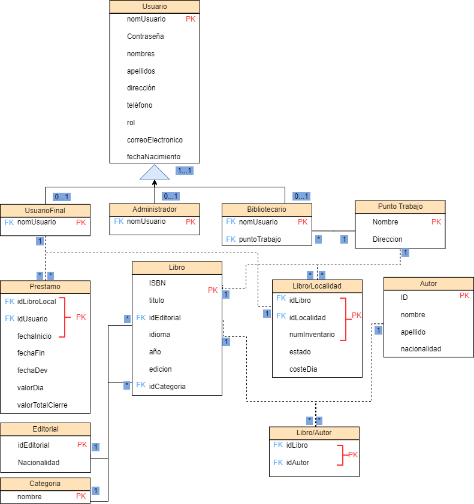

# Sistema de Gestión de Biblioteca

Este proyecto tiene como objetivo desarrollar un sistema para la gestión de bibliotecas, que permita la administración eficiente de inventarios de libros, el manejo de préstamos, devoluciones, reservas, y la autenticación de usuarios con diferentes roles (administradores, bibliotecarios, y usuarios finales).

## Integrantes del Proyecto

- **Andrés David Elizalde Peralta**
- **Emily Julieth Nieves Badillo**
- **Santiago Alexander Ospina Pabon**

## Docente

- **Nury Farelo Velasquez**

## Tabla de Contenido

1. [Descripción del Proyecto](#descripción-del-proyecto)
2. [Funcionalidades Principales](#funcionalidades-principales)
3. [Clases Principales](#clases-principales)
4. [Patrones de Diseño Implementados](#patrones-de-diseño-implementados)
5. [Requisitos del Sistema](#requisitos-del-sistema)
6. [Tecnologías Utilizadas](#tecnologías-utilizadas)
7. [Planteamiento Base de Datos](#planteamiento-base-de-datos)
7. [Planteamiento Interfaz](#planteamiento-interfaz)
9. [Sistemas de Referencia](#sistemas-de-referencia)

---

## Descripción del Proyecto

Este sistema busca mejorar la eficiencia operativa de las bibliotecas, facilitando el acceso de los usuarios a los libros mediante una interfaz intuitiva y funcionalidades avanzadas de búsqueda y reserva. Se identifican varios roles de usuarios que interactúan con el sistema:

- **Administradores**: Gestionan roles de usuarios, libros y generan informes.
- **Bibliotecarios**: Administran los préstamos, devoluciones y el catálogo de libros.
- **Usuarios Finales**: Buscan libros, consultan su disponibilidad y los reservan.

## Funcionalidades Principales

1. **Gestión de Usuarios**:

   - Registro y autenticación de usuarios.
   - Gestión de roles: administradores pueden asignar y modificar roles.

2. **Gestión de Libros**:

   - Agregar, editar y eliminar libros del catálogo.
   - Consultar la disponibilidad de libros.
   - Búsqueda avanzada con múltiples filtros (autor, título, género, etc.).

3. **Gestión de Préstamos y Reservas**:

   - Registro de préstamos y devoluciones.
   - Reserva de libros disponibles o en préstamo.
   - Notificaciones de disponibilidad para usuarios.

4. **Informes y Estadísticas**:
   - Generación de informes sobre préstamos, devoluciones, reservas y uso del catálogo.


## Clases principales

1. **Clase Usuario**: Es la base de todos los tipos de usuarios en el sistema y gestiona la autenticación y el manejo de credenciales. Además, incluye atributos adicionales como dirección, teléfono y fecha de nacimiento

- Atributos:
  - `nomUsuario`: Nombre de usuario.
  - `contraseña`: Contraseña del usuario.
  - `nombres`: Nombre(s) del usuario.
  - `apellidos`: Apellidos del usuario.
  - `direccion`: Dirección del usuario.
  - `telefono`: Número de teléfono.
  - `rol`: Rol del usuario (Administrador, Bibliotecario, Usuario Final).
  - `correoElectronico`: Correo del usuario.
  - `fechaNacimiento`: Fecha de nacimiento del usuario.
- Metodos:
  - `autenticarse()`: Permite a los usuarios autenticarse en el sistema.
  - `cambiarContraseña()`: Permite a los usuarios cambiar su contraseña.
- Codigo:

```python
class Usuario:
   def __init__(self, nombre, correo, identificacion, rol, contraseña):
       self.nombre = nombre
       self.correo = correo
       self.identificacion = identificacion
       self.rol = rol
       self.contraseña = contraseña

   def autenticarse(self, correo, contraseña):
       return self.correo == correo and self.contraseña == contraseña

   def cambiarContraseña(self, nuevaContraseña):
       self.contraseña = nuevaContraseña
```

2. **Clase Administrador**: Hereda de Usuario y tiene las siguientes responsabilidades: gestionar roles, gestionar usuarios, generar informes y gestionar la información de los libros.

- Metodos:
  - `gestionarRoles()`: Asignar roles a los usuarios.
  - `gestionarUsuarios()`: Crear, editar y eliminar usuarios.
  - `generarInformes()`: Generar informes de préstamos, devoluciones y reservas.
  - `gestionarInformacionLibros()`: Gestionar los detalles del catálogo de libros.
- Codigo:

```python
class Administrador(Usuario):
   def gestionarRoles(self):
       # Lógica para gestionar roles
       pass

   def gestionarUsuarios(self):
       # Lógica para gestionar usuarios
       pass

   def generarInformes(self):
       # Lógica para generar informes
       pass
```

3. **Clase Bibliotecario**: Bibliotecario hereda de Usuario y tiene múltiples responsabilidades: registrar préstamos, registrar devoluciones, gestionar el catálogo de libros, buscar libros y gestionar la información de los libros.

- Atributos:
  - `puntoTrabajo`: Lugar físico donde trabaja el bibliotecario.
- Metodos:
  - `registrarPrestamo()`: Registrar el préstamo de un libro.
  - `registrarDevolucion()`: Registrar la devolución de un libro.
  - `gestionarCatalogo()`: Modificar, agregar o eliminar libros del catálogo.
  - `gestionarInformacionLibros()`: Gestionar los detalles del catálogo de libros.
  - `buscarLibros()`: Buscar libros en el sistema.
- Codigo:

```python
class Bibliotecario(Usuario):
    def registrarPrestamo(self, libro, usuario):
        # Lógica para registrar préstamo
        pass

    def registrarDevolucion(self, libro, usuario):
        # Lógica para registrar devolución
        pass

    def gestionarCatalogo(self, libro):
        # Lógica para gestionar el catálogo de libros
        pass
```

4. **Usuario Final**: Hereda de Usuario y se enfoca en la búsqueda, reserva y consulta de disponibilidad de los libros.

- Metodos:

  - `buscarLibros()`: Buscar libros en el catálogo.
  - `reservarLibro()`: Reservar un libro disponible.
  - `consultarDisponibilidad()`: Consultar la disponibilidad de un libro.

- Codigo:

```python
class UsuarioFinal(Usuario):
    def buscarLibros(self, criterio):
        # Lógica para buscar libros por criterio
        pass

    def reservarLibro(self, libro):
        # Lógica para reservar libro
        pass

    def consultarDisponibilidad(self, libro):
        return libro.disponibilidad
```

5. **Libro**: es clave para representar los libros en el sistema y maneja su disponibilidad y la información básica del catálogo.

- Atributos:

  - `ISBN`: Código único del libro.
  - `titulo`: Título del libro.
  - `autor`: Autor del libro.
  - `genero`: Género o categoría del libro.
  - `ubicacion`: Ubicación del libro en la biblioteca.
  - `disponibilidad`: Estado de disponibilidad del libro (Disponible/Prestado/Reservado).
  - `idEditorial`: Identificador de la editorial.
  - `idioma`: Idioma del libro.
  - `año`: Año de publicación.
  - `edicion`: Edición del libro.
  - `idCategoria`: Identificador de la categoría.

- Metodos:

  - `actualizarDisponibilidad()`: Cambiar el estado de disponibilidad del libro.
  - `obtenerInformacion()`: Obtener información completa del libro.

- Codigo:

```python
class Libro:
    def __init__(self, titulo, autor, isbn, genero, ubicacion, disponibilidad=True):
        self.titulo = titulo
        self.autor = autor
        self.isbn = isbn
        self.genero = genero
        self.ubicacion = ubicacion
        self.disponibilidad = disponibilidad

    def actualizarDisponibilidad(self, estado):
        self.disponibilidad = estado

    def obtenerInformacion(self):
        return f"{self.titulo} - {self.autor}, ISBN: {self.isbn}"
```

6. **Reserva**: gestiona la reserva de libros por parte de los usuarios.

- Atributos:

  - `libro`: El libro reservado.
  - `usuario`: El usuario que realiza la reserva.
  - `fechaReserva`: La fecha en la que se realiza la reserva.

- Metodos:

  - `reservar()`: Realiza la reserva de un libro.
  - `cancelarReserva()`: Cancela la reserva de un libro.

- Codigo:

```python
class Reserva:
    def __init__(self, libro, usuario, fechaReserva=date.today()):
        self.libro = libro
        self.usuario = usuario
        self.fechaReserva = fechaReserva

    def reservar(self):
        # Lógica para reservar libro
        pass

    def cancelarReserva(self):
        # Lógica para cancelar reserva
        pass
```


## Patrones de Diseño Implementados

1. **Patrón Singleton**:

   - Implementado para manejar la conexión a la base de datos, asegurando que solo exista una conexión activa para mejorar el rendimiento.

   - En una aplicación grande, puede haber múltiples módulos o clases que necesiten acceder a la base de datos. Con el Singleton, cada uno de estos módulos puede obtener la misma instancia de la conexión de manera segura.

   - Al centralizar la gestión de la conexión de base de datos en un solo lugar, puedes asegurarte de que la conexión se maneja de forma consistente, evitando errores como conexiones no cerradas o conexiones múltiples innecesarias.

   - Ejemplo de la implementacion del patron:

```python
import sqlite3
from sqlite3 import Error

class DatabaseConnection:
    _instance = None

    def __new__(cls):
        if cls._instance is None:
            cls._instance = super(DatabaseConnection, cls).__new__(cls)
            cls._instance._connection = None
        return cls._instance

    def connect(self, db_file):
        """Establecer una conexión con la base de datos SQLite"""
        if self._connection is None:
            try:
                self._connection = sqlite3.connect(db_file)
                print("Conexión a la base de datos establecida.")
            except Error as e:
                print(f"Error al conectar a la base de datos: {e}")
        return self._connection

    def close(self):
        """Cerrar la conexión con la base de datos"""
        if self._connection:
            self._connection.close()
            print("Conexión a la base de datos cerrada.")
            self._connection = None

# Uso del Singleton para manejar la conexión a la base de datos
if __name__ == "__main__":
    # Crear la primera instancia del singleton
    db1 = DatabaseConnection()
    connection1 = db1.connect("example.db")
```

2. **Patrón Builder**:

   - El patrón Builder se utiliza para construir objetos complejos paso a paso. En este sistema, se aplica a la clase `Libro`, que puede tener múltiples atributos como título, autor, ISBN, género, y ubicación. El Builder facilita la creación de instancias de Libro al permitir un proceso de construcción más flexible y controlado.

   - El patrón Builder es ideal para la clase `Libro`, ya que los libros en el sistema de gestión de bibliotecas pueden tener una amplia variedad de atributos que se deben definir. El uso del Builder permite la creación de objetos Libro de forma controlada y con flexibilidad, lo cual es útil en situaciones donde no se tienen todos los datos del libro en un solo momento o algunos atributos son opcionales.

- Director: Es responsable de gestionar el proceso de construcción.

```python
class Director:
    def __init__(self, builder):
        self._builder = builder

    def construirLibro(self, titulo, autor, isbn, genero, ubicacion):
        self._builder.setTitulo(titulo)
        self._builder.setAutor(autor)
        self._builder.setIsbn(isbn)
        self._builder.setGenero(genero)
        self._builder.setUbicacion(ubicacion)
        return self._builder.getResult()
```

- Clase Builder: contiene los pasos para construir un objeto `Libro`.

```python
class LibroBuilder:
    def __init__(self):
        self.libro = Libro(None, None, None, None, None)

    def setTitulo(self, titulo):
        self.libro.titulo = titulo

    def setAutor(self, autor):
        self.libro.autor = autor

    def setIsbn(self, isbn):
        self.libro.isbn = isbn

    def setGenero(self, genero):
        self.libro.genero = genero

    def setUbicacion(self, ubicacion):
        self.libro.ubicacion = ubicacion

    def getResult(self):
        return self.libro
```

- Clase Libro modificada: sigue siendo la misma, pero ahora es construida usando el patrón Builder.

```python
class Libro:
    def __init__(self, titulo, autor, isbn, genero, ubicacion, disponibilidad=True):
        self.titulo = titulo
        self.autor = autor
        self.isbn = isbn
        self.genero = genero
        self.ubicacion = ubicacion
        self.disponibilidad = disponibilidad

    def actualizarDisponibilidad(self, estado):
        self.disponibilidad = estado

    def obtenerInformacion(self):
        return f"{self.titulo} - {self.autor}, ISBN: {self.isbn}"
```

## Requisitos del Sistema

### Requisitos Funcionales

- **Gestión de usuarios**: Registro, autenticación, roles y permisos.
- **Gestión de libros**: Agregar, editar, eliminar y buscar libros.
- **Préstamos y devoluciones**: Registrar préstamos y gestionar la devolución de libros.
- **Reservas**: Reservar libros y gestionar la cola de reservas.
- **Informes**: Generar estadísticas sobre el uso del sistema.

### Requisitos No Funcionales

- **Rendimiento**: El sistema debe ser capaz de manejar hasta 10,000 libros con un tiempo de respuesta de búsqueda menor a 2 segundos.
- **Escalabilidad**: Diseñado para soportar un aumento en la cantidad de usuarios y libros.
- **Seguridad**: Control de acceso basado en roles y encriptación de contraseñas.

## Tecnologías Utilizadas

- **Lenguaje de Programación**: Python
- **Base de Datos**: SQLite (conexión gestionada por el patrón Singleton)
- **Frameworks de Desarrollo**: Flask, Django (dependiendo del alcance)
- **Bibliotecas**: sqlite3 (para la base de datos), etc.
- **Nota**: Debido a la limitacion en conocimientos, el primer boceto de las vistas se realizo en React

## Planteamiento Base de Datos

El siguiente es un planteamiento inicial para la base de datos que manaejaria el sistema:



## Planteamiento Interfaz
- **1. Instalacion**: Si desea desplegar la interfaz propuesta en su ordenador siga los siguientes pasos

    - Primero compruebe que tiene una version de node igual o superior a: `18.16.0`
    Para realizar esto ejecute el siguiente comando:
    ```bash
    node --version
    ```
    - Si cumple con la condicion de node, ejecute el siguiente comando, de lo contrario instale node:
    ```bash
    git clone https://github.com/SneatX/Biblioteca_DS_1.git
    ```
    - Luego instale las dependencias con el siguiente comando:
    ```bash
    npm i
    ```
    - Finalmente ejecute el programa con el siguiente comando:
    ```bash
    npm run dev
    ```
    - El enrutamiento general es `http://localhost:5173/` sin embargo esto puede cambiar segun las especificaciones del usuario

### Panel de inicio:
- El panel de inicio es una pagina sobria, con la informacion acerca del sistema de gestion, sus servicios horarios y hubicacion y una barra de navegacion con la opcion de iniciar sesion
- El enrutamiento es: `http://localhost:5173/`


### Inicio de sesion:
- El panel de inicio de sesion consiste en un formulario con correo electronico y contraseña para niciar sesion, o en dado caso de no poseer cuenta registrarse, el boton de registro no es funcional
- El enrutamiento es: `http://localhost:5173/login`
- Aunque el enturatmiento no esta protegido, si desea simular un loggeo use la siguiente informacion:
    - Para loguearse como usuario coloque el siguiente correo: `user@example.com` con cualquier contraseña
    - Para loguearse como administrador coloque el siguiente correo: `admin@example.com` con cualquier contraseña
    - Para loguearse como bibliotecario coloque el siguiente correo: `librarian@example.com` con cualquier contraseña


### Panel de usuario
- EL panel de usuario es un panel donde el usuario podra consultar los libros para posterirmente hacer peticion de su prestamo o apartarlo en caso de que las existencias se encuentren todas en prestamo, ademas podra ver el registro de sus prestamos con respectivo estado
- El enrutamiento es: `http://localhost:5173/user`


### Panel de administrador
- EL panel de administrado es un panel donde el administrador podra dar permisos de bibliotecario o quitarlos a un usuario, consultar, crear y modificar libros ademas de generar informes
- El enrutamiento es: `http://localhost:5173/admin`


### Panel de bibliotecario
- EL panel de bibliotecario es un panel donde los bibliotecarios podran llevar un control de inventario de su punto fisico, gestionar los prestamos y devoluciones de este, ademas de modificar caracteristicas de los libros
- El enrutamiento es: `http://localhost:5173/librarian`

    
## Sistemas de Referencia

- **Koha**: Sistema de código abierto para la gestión de bibliotecas, utilizado a nivel mundial.
- **Evergreen**: Sistema utilizado por consorcios de bibliotecas públicas, con soporte para API y bibliotecas múltiples.
- **LibraryWorld**: Sistema basado en la nube, ideal para bibliotecas pequeñas.